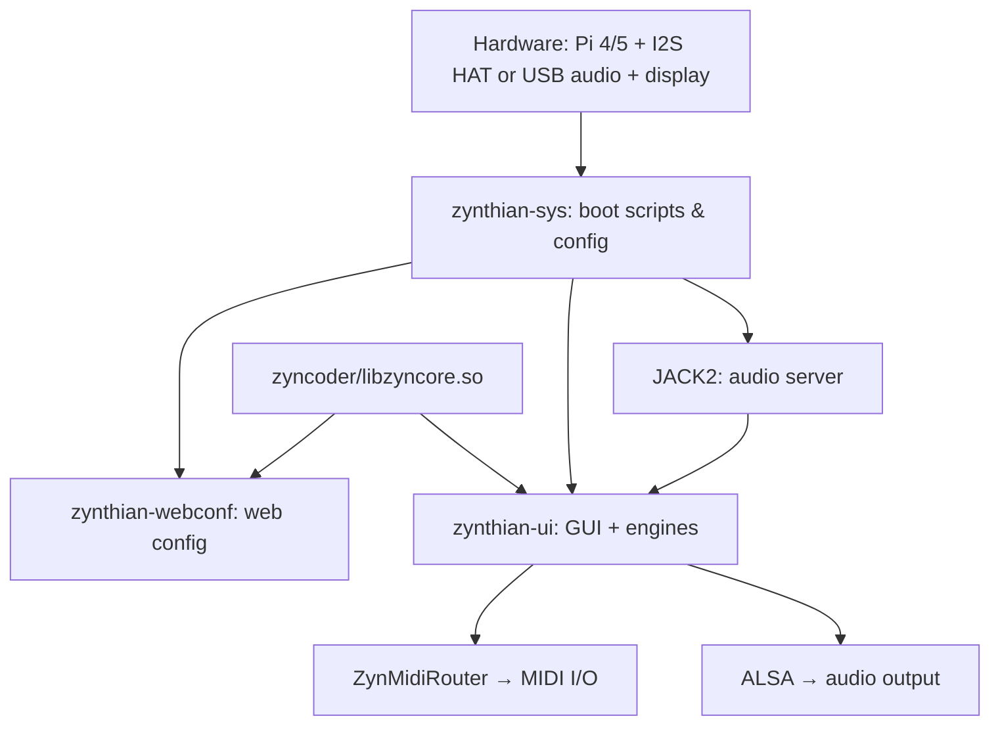

# Architecture

Zynthian is a three-repository system. This page explains how the repos relate to each other, how the system boots, and which service does what.

---

## Repository Map

```
/zynthian/
├── zynthian-sys/         ← system layer: boot scripts, config, hardware detection
├── zynthian-ui/          ← application layer: GUI + synth engines
├── zynthian-webconf/     ← web interface: configuration via browser
└── zyncoder/             ← native C library (compiled separately; not a separate repo)
    └── build/
        └── libzyncore.so ← required by zynthian-ui and zynthian-webconf
```

All three repos live under `/zynthian/`. The compiled `libzyncore.so` is a shared dependency — both `zynthian-ui` and `zynthian-webconf` import it at startup.

---

## Layer Diagram



---

## Boot Sequence

### First Boot (one-time only)

`first_boot.service` runs as a one-shot systemd unit:

1. **Hardware autodetect** — `zynthian_autoconfig.py` scans i2c bus for known chips (PCM1863, PCM5242, RV3028, TPA6130, MCP23017). Selects matching hardware profile (V5, Z2, HifiBerry, etc.) and writes `zynthian_envars.sh`.
2. **Fix ALSA mixer controls** — `fix_soundcard_mixer_ctrls.py` sets sane defaults for the detected audio device.
3. **SSH key regeneration** — deletes and recreates host keys so each Pi has unique identity.
4. **WiFi access point** — creates a `ZynthianAP` hotspot so you can connect without a router.
5. **LV2 cache rebuild** — `jalv --scan` catalogs all installed LV2 plugins; takes 5–10 minutes.
6. **Filesystem expand** — `raspi-config --expand-rootfs` grows the root partition to fill the SD card.
7. **Reboot** — service disables itself, Pi reboots into normal mode.

After first boot, `first_boot.service` is disabled permanently.

### Every Boot

```
multi-user.target
    └── zynthian-config-on-boot.service   (runs config-on-boot.sh)
         └── jack2.service                (JACK audio server)
              ├── zynthian.service         (startx → zynthian_main.py)
              └── zynthian-webconf.service (Tornado web server on port 80)
```

`config-on-boot.sh` checks for a `/boot/zynthian_envars.sh` override and applies any pending software updates. After finishing, it starts JACK.

JACK must be running before either the UI or webconf can start (both are `Requires=jack2.service`).

---

## zynthian-sys

**Role:** System glue. Does not contain synth logic.

Key files:

| File | Purpose |
|------|---------|
| `sbin/first_boot.sh` | One-time first-boot setup |
| `sbin/config-on-boot.sh` | Per-boot config check and update |
| `sbin/zynthian_autoconfig.py` | Hardware detection via i2c scan |
| `sbin/fix_soundcard_mixer_ctrls.py` | Set audio device mixer defaults |
| `etc/systemd/*.service` | All systemd unit files |
| `config/zynthian_envars_V5.sh` | Environment variables for V5 hardware |
| `config/wiring-profiles/` | GPIO wiring layouts for different control panels |

Environment variables from `zynthian_envars.sh` (auto-generated by autoconfig) control everything downstream: audio device, display type, wiring layout, MIDI DIN enable.

---

## zynthian-ui

**Role:** The Zynthian application. Runs inside X11 (started by `startx ./zynthian.sh`).

Key subpackages:

| Path | Role |
|------|------|
| `zynthian_main.py` | Entry point; initializes chains, MIDI router, GUI |
| `zyngui/` | All GUI screens (`zynthian_gui_*.py`) |
| `zyngine/` | Engine wrappers for each synth |
| `zynautoconnect/` | JACK and ALSA MIDI auto-connection daemon |

### Engine Architecture

Each synth engine is a Python class in `zyngine/` that wraps an external process:

```
zynthian_engine_fluidsynth.py → runs fluidsynth subprocess
zynthian_engine_zynaddsubfx.py → runs zynaddsubfx subprocess
zynthian_engine_jalv.py → runs jalv (LV2 host) subprocess
... etc.
```

The engine class handles: starting the subprocess, sending parameter changes, loading banks/presets, stopping.

`zynthian_chain_manager.py` manages chains. Each chain is one engine instance with MIDI routing and audio output assignments. Multiple chains run simultaneously — the chain manager handles start/stop/routing.

### libzyncore.so Dependency

`zyngine/zynthian_chain_manager.py` imports `lib_zyncore` at module load time:
```python
from zynlibs.zyncore import lib_zyncore
```

`lib_zyncore` is the Python binding to `libzyncore.so`, the compiled C library from `zyncoder/`. If this `.so` is missing, the entire UI fails to start, and webconf also fails (since it imports from `zyngui`).

**Rebuild if missing:**
```bash
cd /zynthian/zyncoder
mkdir -p build && cd build
cmake .. && make -j4
```

---

## zynthian-webconf

**Role:** Configuration web interface. Tornado-based HTTP server on port 80.

Key files:

| File | Role |
|------|------|
| `zynthian_webconf.py` | Tornado app entry point |
| `lib/audio_config_handler.py` | Audio device selection |
| `lib/midi_config_handler.py` | MIDI port config |
| `lib/hwoptions_config_handler.py` | Hardware options |
| `lib/display_config_handler.py` | Display settings |
| `lib/dashboard_handler.py` | System status dashboard |
| `lib/wifi_config_handler.py` | WiFi management |
| `lib/security_config_handler.py` | Password management |

Webconf reads and writes `zynthian_envars.sh` for most settings. Changes take effect after reboot (for hardware settings) or service restart (for MIDI/software settings).

---

## JACK and Audio Routing

JACK is the audio backend. All engines connect to JACK, and JACK routes audio to the ALSA hardware device.

```
Engine (FluidSynth) → JACK port → ZynMixer → JACK port → ALSA hw:S2 → speaker
```

`zynautoconnect` runs as a thread inside zynthian-ui and automatically wires new JACK clients to the right ports based on chain configuration.

**JACK is configured by** `zynthian_envars.sh`:
```bash
JACKD_OPTIONS="-P 70 -t 2000 -s a -d alsa -d hw:S2 -r 44100 -p 256 -n 3"
```

- `-d hw:S2` — use ALSA card named `S2`
- `-r 44100` — 44100 Hz sample rate
- `-p 256` — 256 frames per period (latency)
- `-n 3` — 3 periods per cycle

---

## MIDI Routing

`ZynMidiRouter` is a native C module (part of `zyncoder`) that handles MIDI routing between:
- External MIDI inputs (USB, BLE, DIN-5, network)
- Synth engine MIDI inputs (one per chain)
- MIDI outputs / THRU

The router applies channel filtering — chain 1 receives channel 1, chain 2 receives channel 2, etc. — unless a chain is set to Omni.

---

## What's Next

- [Getting Started](getting-started.md) — practical first-time setup
- [Troubleshooting](troubleshooting.md) — when things go wrong
- [Webconf Reference](webconf.md) — configuration interface

---

*Version: 2026-05-25 — derived from `zynthian-sys/sbin/`, `zynthian-ui/zyngine/`, `zynthian-webconf/zynthian_webconf.py`.*
