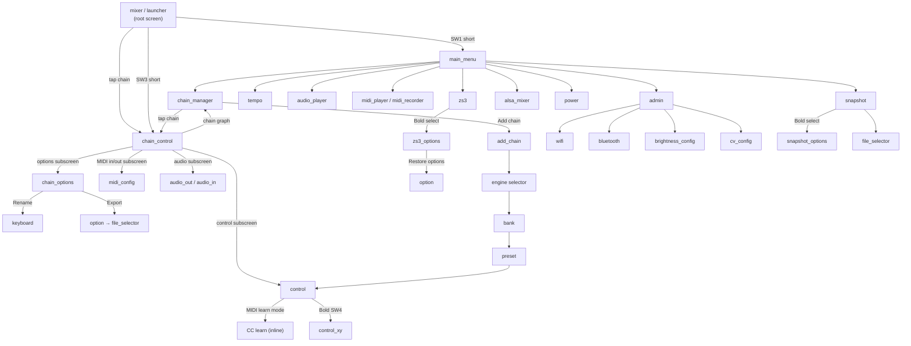

# UI Navigation & Screen Map

This page explains how the Zynthian touch display is organized, how to reach any screen from any other, and the navigation patterns that apply everywhere.

---

## Root Screen: Mixer and Launcher

When Zynthian starts, the **Mixer** screen is the home view. It shows one vertical strip per chain — left-to-right across the display — with the master chain always at the far right.

Each strip shows:
- Chain name and engine type at the top
- A vertical fader for volume
- Level meters (DPM) when enabled
- Mute / solo indicator

Below the chain strips, the screen can switch between two tab views:

| Tab | Shows | Switch |
|-----|-------|--------|
| **Mixer** | Volume faders and DPM meters for each chain | Tap mixer label |
| **Launcher** | Clip/sequence pads (rows = phrases) per chain | Tap launcher label |

The mixer is the root — pressing Back from any screen eventually returns here.

---

## Status Bar

Runs across the top of every screen.

```
┌──────┬──────┬──────┬──────┬──────┬──────┐
│ IP   │ CPU% │ ↑↓↑  │ 🔊   │ ♩    │ ↻    │
└──────┴──────┴──────┴──────┴──────┴──────┘
```

| Icon / Field | Meaning |
|---|---|
| IP address | Current IP on `wlan0` or `eth0` |
| CPU% | System CPU load — above 80% expect XRUNs |
| MIDI activity | Flashes on incoming MIDI |
| Audio activity | Flashes on audio output |
| Tempo | Current BPM (tap to change) |
| ↻ / ⬇ | Update available indicator |

---

## Main Menu

Accessed by: **SW1 short press** (V5), or **long-press Back** on most screens.

A 3×3 grid of buttons:

| Button | Action |
|--------|--------|
| Chain Manager | Open chain graph view for all chains |
| Snapshots | Browse, save, load snapshot files |
| ZS3 | Browse and recall sub-snapshots |
| Tempo | Tap-tempo and BPM dial |
| Audio Player | Load and play audio files |
| MIDI Player | Play MIDI files through loaded chains |
| Admin | System and hardware settings |
| Soundcard Levels | ALSA mixer for the audio interface |
| Power | Shutdown or reboot |

Source: [`zyngui/zynthian_gui_main_menu.py:38`](../zynthian-ui/zyngui/zynthian_gui_main_menu.py)

---

## Complete Screen Map



---

## Navigation Patterns

### Generic Selector (most list screens)

Zynthian uses a single list widget in most screens. The interaction model is the same everywhere:

| Action | Effect |
|--------|--------|
| Encoder 3 rotate | Scroll list up/down |
| Encoder 3 push (short) | Select item |
| Encoder 3 push (bold) | Open options for selected item |
| Encoder 4 rotate | Adjust value (parameter screens) |
| Back (SW2 short) | Go to previous screen |
| SW1 short | Go to Main Menu |

### Touchscreen

Tap any list item to select it. Long-press (hold ~300ms) to open options — equivalent to bold encoder press. On the mixer, tap a chain strip to enter chain_control for that chain.

### V5 Encoders

| Encoder | Default function on most screens |
|---------|----------------------------------|
| 1 (leftmost) | Chain select — rotate to switch active chain |
| 2 | Parameter page or list scroll (context-dependent) |
| 3 | List navigation / item selection |
| 4 | Value adjustment |

The exact function of each encoder changes per screen. The current assignment is shown in the four corners of the control screen.

### Soft Buttons (Touchscreen V5-style footer)

Not present on all hardware. On touch-only devices, three tap zones appear at the bottom of most screens:

| Zone | Typical function |
|------|-----------------|
| Left | Back / Cancel |
| Center | Select / Confirm |
| Right | Menu / Options |

---

## Screen Types

Zynthian has three screen classes:

| Type | Example screens | Navigation |
|------|----------------|------------|
| **Selector** | bank, preset, zs3, snapshot | Encoder 3 = scroll, push = select |
| **Grid** | main_menu, add_chain | Tap or encoder navigate cells |
| **Control** | control, control_xy | Encoders map to on-screen knobs |

---

## Going Back

From any screen, press **Back (SW2 short)** to return to the previous screen. The navigation stack is linear — back always undoes one step. From the mixer root, Back has no effect (already home).

---

## What's Next

- [Chains & Routing](chain-management.html) — add and configure chains
- [Control Screen](control-screen.html) — adjust synth parameters
- [ZS3 Subsnapshots](zs3-guide.html) — live performance recall
- [Admin & System](admin-guide.html) — WiFi, Bluetooth, updates

---

*Version: 2026-05-25 — derived from `zyngui/zynthian_gui_main_menu.py`, `zyngui/zynthian_gui_mixer.py`, `zyngui/zynthian_gui_chain_control.py`.*
