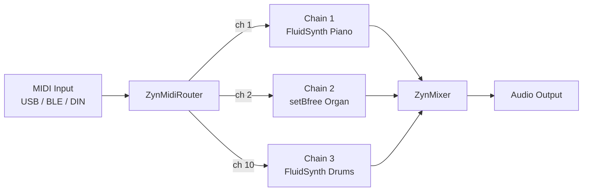
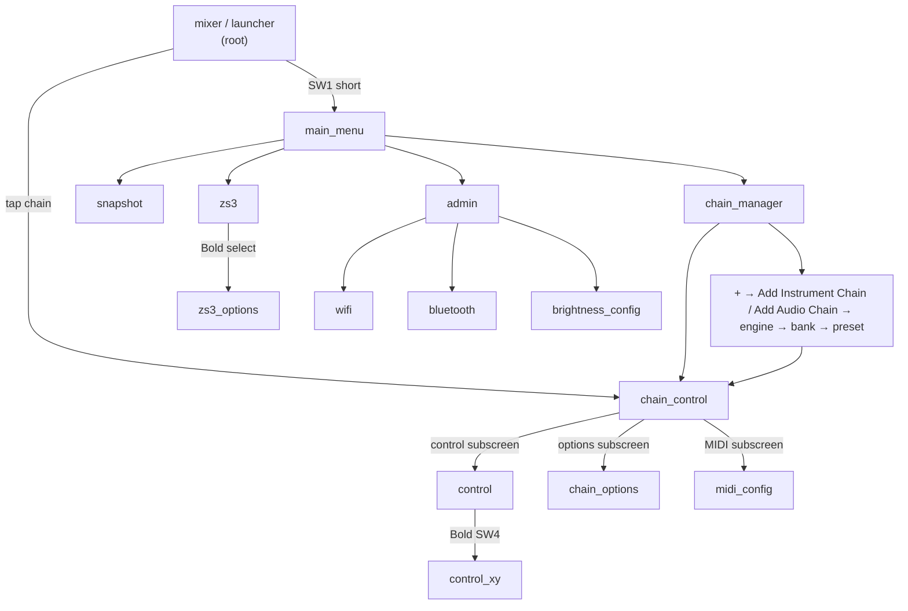

# Understanding Zynthian

This page explains how Zynthian thinks about music-making — the mental model behind chains, engines, snapshots, and the signal flow. Read this before diving into individual features.

---

## Getting Around

| Goal | Touch keypad |
|------|-------------|
| Open Main Menu | **OPT/ADMIN** (short) |
| Add a chain | Tap **+** at right edge of Mixer |
| Open Launcher / step sequencer | **PAD/STEP** (short) |
| Load a snapshot | **ZS3/SHOT** (bold hold, 300ms) |
| Open chain control | Tap any chain strip in the Mixer |
| Go back | **BACK/NO** |
| Start / stop transport | **PLAY (▶)** / **STOP (■)** in bottom row |
| Hardware levels | **MIX/LEVEL** (bold hold, 300ms) |

---

## What Zynthian Is

Zynthian is a self-contained music computer built on Raspberry Pi. It runs a collection of free Linux synthesizer engines (ZynAddSubFX, FluidSynth, setBfree, and many LV2 plugins) inside a unified interface that handles MIDI routing, audio mixing, and state management.

Unlike a plugin host on a desktop computer, Zynthian is designed to work without a screen, without a desktop OS, and without a keyboard and mouse — though all of those can be attached. The physical Zynthian box typically has four rotary encoders, a small touchscreen, and audio I/O. The web interface at `http://zynthian.local` provides full configuration from any browser on the network.

---

## Chains and Engines

The core unit in Zynthian is a **chain**: a path from a MIDI input through a synthesizer engine (or effect processor) to an audio output. Each chain runs one engine. Multiple chains can run simultaneously on separate MIDI channels — piano on channel 1, organ on channel 2, drums on channel 10.

An **engine** is the sound-making component of a chain. A **preset** is a saved engine configuration — a specific instrument sound. Presets are organized into **banks**.

```
Chain = MIDI channel + Engine + Preset + Audio output assignment
```



---

### Adding a chain

Tap **+** in the mixer/launcher screen. The **Add Chain...** screen shows a grid of chain type buttons:

| Button | Use for |
|--------|---------|
| **Instrument** | Synth engines (ZynAddSubFX, FluidSynth, setBfree, etc.) — receives MIDI, produces audio |
| **Audio Input** | Audio processing chains — LV2 effects, MOD-UI pedalboards — takes live audio input |
| **MIDI + Audio** | Chains that process both MIDI and audio |
| **Audio Generator** | Audio generators not driven by MIDI notes |
| **MIDI** | MIDI tool chains (no audio output) |
| **Clip Launcher** | Clip/phrase sequencer launcher |
| **Mixbus** | Mix bus effects chain |
| **Special** | Other chain types |

After selecting chain type, pick the engine, then bank, then preset.

---

## Signal Flow

MIDI arrives from any connected controller and is routed by the ZynMidiRouter [`zynthian-ui/zyngine/zynthian_engine_midi_control.py`] to chains by channel number. Each chain's engine produces audio that flows through the JACK audio graph to the output device. The ZynMixer provides per-chain volume, pan, and mute/solo.

The full software stack:

```
Hardware controller → USB/BLE/DIN → ZynMidiRouter
                                          ↓ (per channel)
                               Engine subprocess (JACK client)
                                          ↓
                               ZynMixer (JACK client)
                                          ↓
                               ALSA hw:CardName (JACK output)
                                          ↓
                               Speaker / Headphones
```

JACK is the connective tissue [`zynthian-sys/etc/systemd/jack2.service`]. If JACK is not running, no sound is possible — all engines require it.

---

## Navigation: Screen Layout

The main Zynthian screen shows:

```
┌───────────────────────────────────────────┐
│  192.168.1.5  │ CPU 32% │ ♩120 │ ↑↓  │ ↻ │  ← Status bar
├───────────────────────────────────────────┤
│                                           │
│  Chain strips (mixer) or clip pads        │  ← Main area
│                                           │
│  [Chain 1] [Chain 2] [Chain 3] [Master]   │
└───────────────────────────────────────────┘
```

The status bar shows IP address, CPU%, tempo, MIDI/audio activity, and an update indicator (↻) when software updates are available.

---

## Main Menu

Tap **OPT/ADMIN** (short) on the touch keypad, or press SW1 short (V5 hardware) to open the Main Menu — a 3×3 grid of quick-access buttons:

| Button | Opens | Use for |
|--------|-------|---------|
| Chain Manager | chain_manager | See and edit all chains in a graph |
| Snapshots | snapshot | Load/save full setups |
| ZS3 | zs3 | Recall sub-snapshots by Program Change |
| Tempo | tempo | Set BPM or tap tempo |
| Audio Player | audio_player | Play audio files through the system |
| MIDI Player | midi_player | Play MIDI files through loaded chains |
| Admin | admin | System settings, WiFi, Bluetooth, updates |
| Soundcard Levels | alsa_mixer | ALSA hardware mixer controls |
| Power | power | Shutdown / reboot |

Source: [`zyngui/zynthian_gui_main_menu.py`](../zynthian-ui/zyngui/zynthian_gui_main_menu.py)

---

## Screen Map



---

## V5 Hardware Controls

On a V5 kit, the four rotary encoders each control a layer of the UI:

| Encoder | Default Function |
|---------|-----------------|
| 1 (leftmost) | Chain select — cycles through chains |
| 2 | Bank select — cycles through preset banks |
| 3 | Preset select — cycles through presets |
| 4 | Volume / parameter value |
| Any encoder push | Select / confirm |

**Button press durations on V5:**

| Duration | Name | Threshold |
|----------|------|-----------|
| Tap (< 300ms) | Short | `ZYNTHIAN_UI_SWITCH_BOLD_MS` |
| Hold (300ms–2s) | Bold | `ZYNTHIAN_UI_SWITCH_BOLD_MS` to `_LONG_MS` |
| Long hold (> 2s) | Long | `ZYNTHIAN_UI_SWITCH_LONG_MS` |

Short/Bold/Long triggers different actions per switch. These are configurable via `ZYNTHIAN_WIRING_CUSTOM_SWITCH_NN__UI_SHORT/BOLD/LONG` in the envars file [`zynthian-sys/config/zynthian_envars_V5.sh`].

**Common V5 button actions (default profile):**

| Switch | Short | Bold | Long |
|--------|-------|------|------|
| SW1 | MENU | SCREEN_ADMIN | POWER_OFF |
| SW2 | SCREEN_AUDIO_MIXER | SCREEN_ALSA_MIXER | ALL_SOUNDS_OFF |
| SW3 | CHAIN_CONTROL | BANK_PRESET | PRESET_FAV |
| SW4 | SCREEN_ZS3 | SCREEN_SNAPSHOT | — |

---

## MIDI Channel Routing

By default:
- Chain 1 → MIDI channel 1
- Chain 2 → MIDI channel 2
- (and so on)

To change: tap the chain → chain options → **MIDI Channel**.

Set a chain to **Omni** to respond to all MIDI channels simultaneously.

Use a **Note Range** (chain options → Note Range) to split a keyboard: e.g. Piano below C4, Organ above C4.

---

## Snapshots

A **snapshot** saves the complete Zynthian state: all chains, their engines, presets, MIDI routing, and mixer settings. One `.zss` file = one complete live setup. Load a snapshot to instantly switch between setups.

The special file `last_state.zss` is auto-loaded on every boot. Save to it to make a setup permanent.

Snapshots live in `/zynthian/zynthian-my-data/snapshots/<bank>/` (they must be in a bank subfolder — `000/` is the default). See [Snapshots](snapshots.html) for the full workflow including the bank subdir requirement.

---

## Touch vs. Encoders vs. Web

Zynthian supports three interaction modes simultaneously:

**V5 touch keypad:** a software button panel on the left side of the display. Tap to navigate — OPT/ADMIN, PAD/STEP, ZS3/SHOT, transport controls. Primary interface for all tutorials. Activate via Admin → Touch Navigation → V5 keypad at left. See [UI Navigation](ui-navigation.html) for the full button reference.

**Touchscreen (direct):** tap chains, select engines, navigate menus. Works alongside the touch keypad — the keypad handles navigation, the main area handles selection.

**Rotary encoders (V5 kit):** four encoders navigate menus and adjust parameters without looking at the screen. Push to select. Most useful during a live performance.

**Web interface (`http://zynthian.local`):** full configuration from any browser. Required for audio/JACK settings, MIDI port enable/disable, and software updates — tasks not available from the touchscreen UI. See [Webconf Reference](webconf.html).

---

## ZS3 — Zynthian Subsnapshots

ZS3 (Zynthian SubSnapshot 3) lets you store and recall partial state changes within a running performance — different from a full snapshot. ZS3 can save:
- MIDI channel assignments per chain
- Engine parameters
- Mixer levels

Recall a ZS3 via Program Change messages from a MIDI controller. Useful for switching between song arrangements without stopping audio.

---

## What's Next

- [UI Navigation](ui-navigation.html) — screen map and navigation patterns
- [Chains & Routing](chain-management.html) — add and configure chains
- [Control Screen](control-screen.html) — adjust synth parameters
- [Synth Engines](synth-engines.html) — which engines to use and when
- [Recipes](recipes.html) — practical multi-engine setups
- [Snapshots](snapshots.html) — saving and restoring setups
- [MIDI Controllers](midi.html) — connecting physical instruments

---

*Version: 2026-05-25 — derived from `zynthian-ui/zyngine/`, `zynthian-ui/zyngui/`, `zynthian-sys/config/zynthian_envars_V5.sh`.*
