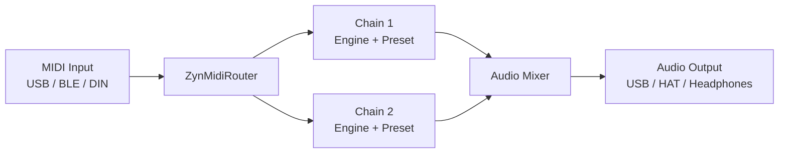

# Understanding Zynthian

This page explains how Zynthian thinks about music-making — the mental model behind chains, engines, snapshots, and the signal flow. Read this before diving into individual features.

---

## What Zynthian Is

Zynthian is a self-contained music computer built on Raspberry Pi. It runs a collection of free Linux synthesizer engines (ZynAddSubFX, FluidSynth, setBfree, and many LV2 plugins) inside a unified interface that handles MIDI routing, audio mixing, and state management. Unlike a plugin host on a desktop computer, Zynthian is designed to work without a screen, without a desktop OS, and without a keyboard and mouse — though all of those can be attached.

The physical Zynthian box typically has four rotary encoders, a small touchscreen, and audio I/O. The web interface (`http://zynthian.local`) provides full configuration from any browser on your network.

---

## Chains and Engines

The core unit in Zynthian is a **chain**: a path from a MIDI input through a synthesizer engine (or effect processor) to an audio output. Each chain runs one engine. You can have multiple chains running simultaneously, layered or on separate MIDI channels.

An **engine** is the sound-making or sound-processing component of a chain. Examples: ZynAddSubFX produces sounds from additive/subtractive synthesis; FluidSynth plays SF2 soundfonts; setBfree emulates a Hammond organ; a Calf Reverb LV2 plugin adds reverb to an audio input. Engines are implemented in `zyngine/zynthian_engine_*.py` [`zynthian-ui/zyngine/`].

A **preset** is a named configuration saved inside an engine — a specific instrument sound within FluidSynth's soundfont, for example, or a ZynAddSubFX patch. Presets are organized into **banks**.

---

## Signal Flow

MIDI arrives from any connected controller and is routed by the ZynMidiRouter to the relevant chain(s). Each chain produces audio, which flows through the internal JACK mixer to the selected output device. All of this runs inside a JACK audio graph managed by `jack2.service` [`zynthian-sys/etc/systemd/jack2.service`].

---

## Snapshots

A **snapshot** saves the complete state of Zynthian: all chains, their engines, presets, controllers, MIDI routing, and mixer settings. Loading a snapshot restores everything instantly — a complete live setup from a single file.

Snapshots are stored as `.zss` files in `/zynthian/zynthian-my-data/snapshots/`. The special file `last_state.zss` is the state Zynthian restores automatically on startup.

Use snapshots to switch between complete setups during a performance, or to save a work-in-progress and resume later. The [Snapshots](snapshots.md) page covers the full workflow.

---

## The Web Interface

The webconf tool at `http://zynthian.local` is the main way to configure Zynthian without a physical encoder/screen setup. It covers hardware (audio device, display, wiring), MIDI configuration, engine options, snapshot management, and system administration. Changes made in webconf are saved to environment variables in `/etc/zynthian_envars.sh` and take effect after a reboot or service restart.

---

## Touch vs. Encoders vs. Web

Zynthian supports three interaction modes simultaneously:

**Touchscreen:** tap layers, select engines, navigate menus directly on the display.

**Rotary encoders:** the four physical encoders on a Zynthian kit navigate menus and adjust parameters without a screen tap. Each encoder has a push-to-select function.

**Web interface:** full configuration from any browser on the same network. Required for initial setup (audio device, display type) and for tasks that aren't exposed on the touchscreen (MIDI port configuration, system updates).

---

## What's Next

- [Synth Engines](synth-engines.md) — which engines to use and when
- [Snapshots](snapshots.md) — saving and restoring setups
- [MIDI Controllers](midi.md) — connecting physical instruments
- [Webconf Reference](webconf.md) — all configuration options

---

*Version: 2026-05-25 — derived from `zynthian-ui/zyngine/`, `zynthian-ui/zyngui/zynthian_gui_chain_manager.py`.*
