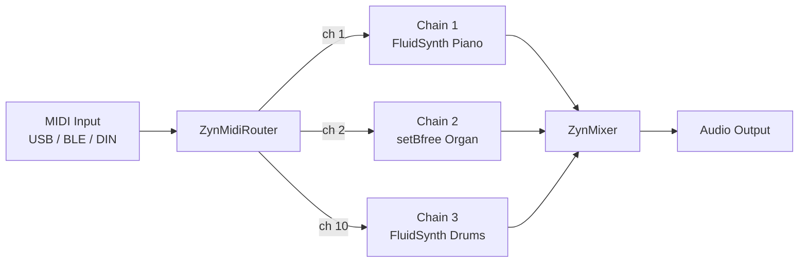

# Understanding Zynthian

This page explains how Zynthian thinks about music-making — the mental model behind chains, engines, snapshots, and the signal flow. Read this before diving into individual features.

---

## What Zynthian Is

Zynthian is a self-contained music computer built on Raspberry Pi. It runs a collection of free Linux synthesizer engines (ZynAddSubFX, FluidSynth, setBfree, and many LV2 plugins) inside a unified interface that handles MIDI routing, audio mixing, and state management.

Unlike a plugin host on a desktop computer, Zynthian is designed to work without a screen, without a desktop OS, and without a keyboard and mouse — though all of those can be attached. The physical Zynthian box typically has four rotary encoders, a small touchscreen, and audio I/O. The web interface at `http://zynthian.local` provides full configuration from any browser on the network.

---

## Chains and Engines

The core unit in Zynthian is a **chain**: a path from a MIDI input through a synthesizer engine (or effect processor) to an audio output. Each chain runs one engine. Multiple chains can run simultaneously on separate MIDI channels — piano on channel 1, organ on channel 2, drums on channel 10.

An **engine** is the sound-making component of a chain. A **preset** is a saved engine configuration — a specific instrument sound. Presets are organized into **banks**.

```
Chain = MIDI channel + Engine + Preset + Audio output assignment
```



---

## Signal Flow

MIDI arrives from any connected controller and is routed by the ZynMidiRouter [`zynthian-ui/zyngine/zynthian_engine_midi_control.py`] to chains by channel number. Each chain's engine produces audio that flows through the JACK audio graph to the output device. The ZynMixer provides per-chain volume, pan, and mute/solo.

The full software stack:

```
Hardware controller → USB/BLE/DIN → ZynMidiRouter
                                          ↓ (per channel)
                               Engine subprocess (JACK client)
                                          ↓
                               ZynMixer (JACK client)
                                          ↓
                               ALSA hw:CardName (JACK output)
                                          ↓
                               Speaker / Headphones
```

JACK is the connective tissue [`zynthian-sys/etc/systemd/jack2.service`]. If JACK is not running, no sound is possible — all engines require it.

---

## Navigation: Screen Layout

The main Zynthian screen shows:

```
┌─────────────────────────────────┐
│ [IP]  [CPU%]  [AUDIO]  [MIDI]   │  ← Status bar
├─────────────────────────────────┤
│                                 │
│   Chain list / Active screen    │  ← Main area
│                                 │
├───────────┬───────────┬─────────┤
│  [Chain]  │ [Preset]  │  [Mix]  │  ← Soft buttons (touchscreen)
└───────────┴───────────┴─────────┘
```

The status bar shows IP address, CPU usage, and MIDI/audio activity indicators.

---

## V5 Hardware Controls

On a V5 kit, the four rotary encoders each control a layer of the UI:

| Encoder | Default Function |
|---------|-----------------|
| 1 (leftmost) | Chain select — cycles through chains |
| 2 | Bank select — cycles through preset banks |
| 3 | Preset select — cycles through presets |
| 4 | Volume / parameter value |
| Any encoder push | Select / confirm |

**Button press durations on V5:**

| Duration | Name | Threshold |
|----------|------|-----------|
| Tap (< 300ms) | Short | `ZYNTHIAN_UI_SWITCH_BOLD_MS` |
| Hold (300ms–2s) | Bold | `ZYNTHIAN_UI_SWITCH_BOLD_MS` to `_LONG_MS` |
| Long hold (> 2s) | Long | `ZYNTHIAN_UI_SWITCH_LONG_MS` |

Short/Bold/Long triggers different actions per switch. These are configurable via `ZYNTHIAN_WIRING_CUSTOM_SWITCH_NN__UI_SHORT/BOLD/LONG` in the envars file [`zynthian-sys/config/zynthian_envars_V5.sh`].

**Common V5 button actions (default profile):**

| Switch | Short | Bold | Long |
|--------|-------|------|------|
| SW1 | MENU | SCREEN_ADMIN | POWER_OFF |
| SW2 | SCREEN_AUDIO_MIXER | SCREEN_ALSA_MIXER | ALL_SOUNDS_OFF |
| SW3 | CHAIN_CONTROL | BANK_PRESET | PRESET_FAV |
| SW4 | SCREEN_ZS3 | SCREEN_SNAPSHOT | — |

---

## MIDI Channel Routing

By default:
- Chain 1 → MIDI channel 1
- Chain 2 → MIDI channel 2
- (and so on)

To change: tap the chain → chain options → **MIDI Channel**.

Set a chain to **Omni** to respond to all MIDI channels simultaneously.

Use a **Note Range** (chain options → Note Range) to split a keyboard: e.g. Piano below C4, Organ above C4.

---

## Snapshots

A **snapshot** saves the complete Zynthian state: all chains, their engines, presets, MIDI routing, and mixer settings. One `.zss` file = one complete live setup. Load a snapshot to instantly switch between setups.

The special file `last_state.zss` is auto-loaded on every boot. Save to it to make a setup permanent.

Snapshots live in `/zynthian/zynthian-my-data/snapshots/`. See [Snapshots](snapshots.md) for the full workflow.

---

## Touch vs. Encoders vs. Web

Zynthian supports three interaction modes simultaneously:

**Touchscreen:** tap chains, select engines, navigate menus directly. Most operations reachable in 2–3 taps.

**Rotary encoders (V5 kit):** four encoders navigate menus and adjust parameters without looking at the screen. Push to select. Most useful during a live performance.

**Web interface (`http://zynthian.local`):** full configuration from any browser. Required for initial audio/display setup and for tasks not exposed on the touchscreen (MIDI port configuration, software updates). See [Webconf Reference](webconf.md).

---

## ZS3 — Zynthian Subsnapshots

ZS3 (Zynthian SubSnapshot 3) lets you store and recall partial state changes within a running performance — different from a full snapshot. ZS3 can save:
- MIDI channel assignments per chain
- Engine parameters
- Mixer levels

Recall a ZS3 via Program Change messages from a MIDI controller. Useful for switching between song arrangements without stopping audio.

---

## What's Next

- [Synth Engines](synth-engines.md) — which engines to use and when
- [Recipes](recipes.md) — practical multi-engine setups
- [Snapshots](snapshots.md) — saving and restoring setups
- [MIDI Controllers](midi.md) — connecting physical instruments
- [Webconf Reference](webconf.md) — all configuration options

---

*Version: 2026-05-25 — derived from `zynthian-ui/zyngine/`, `zynthian-ui/zyngui/`, `zynthian-sys/config/zynthian_envars_V5.sh`.*
